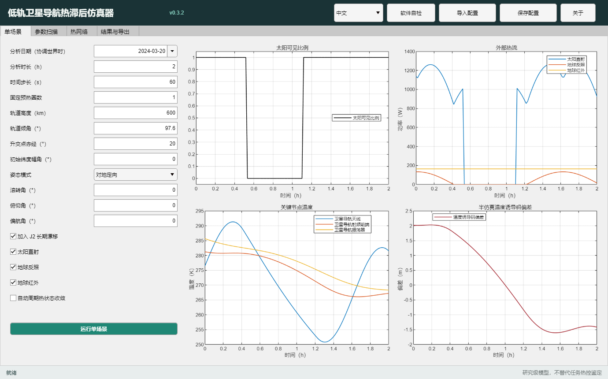
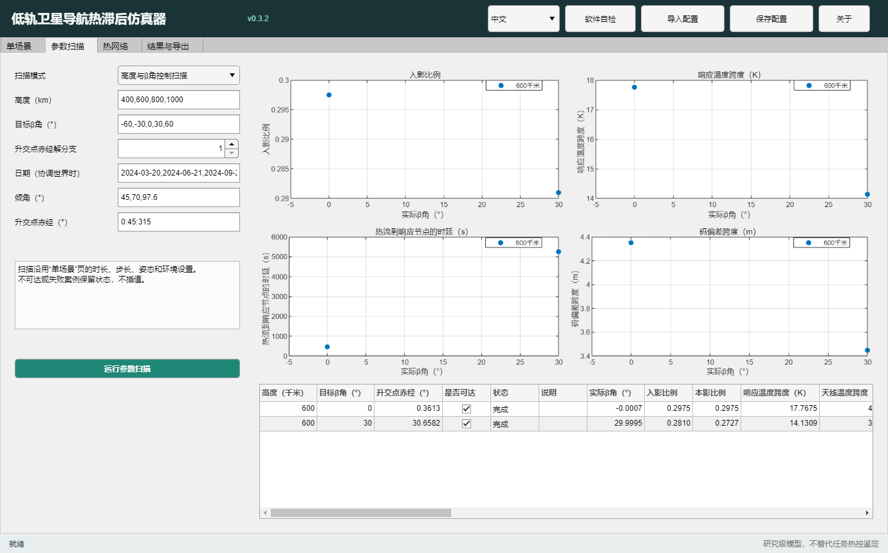
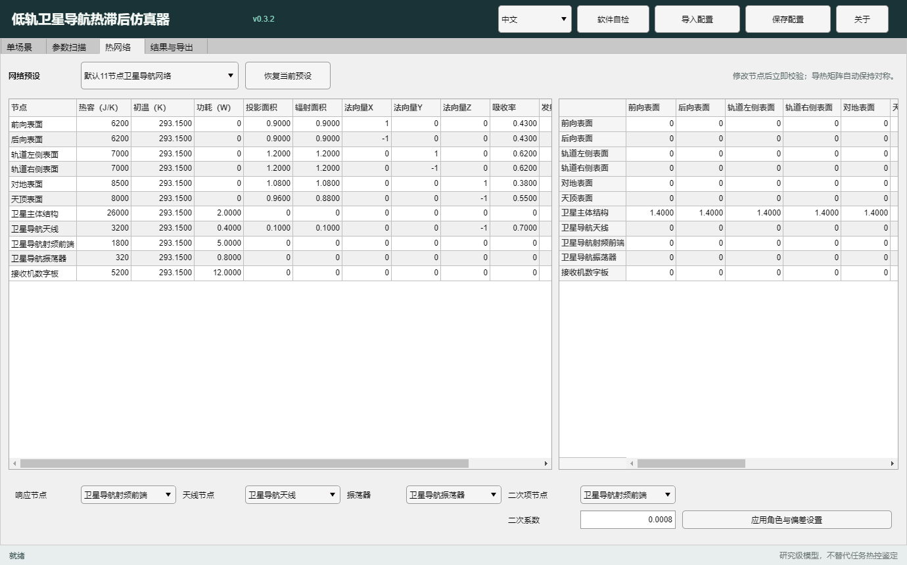
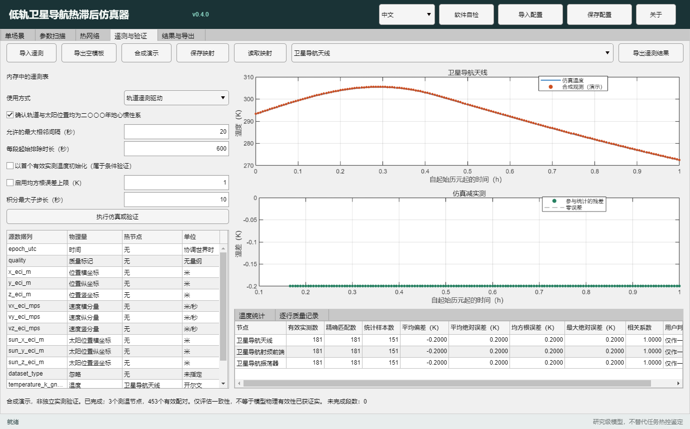
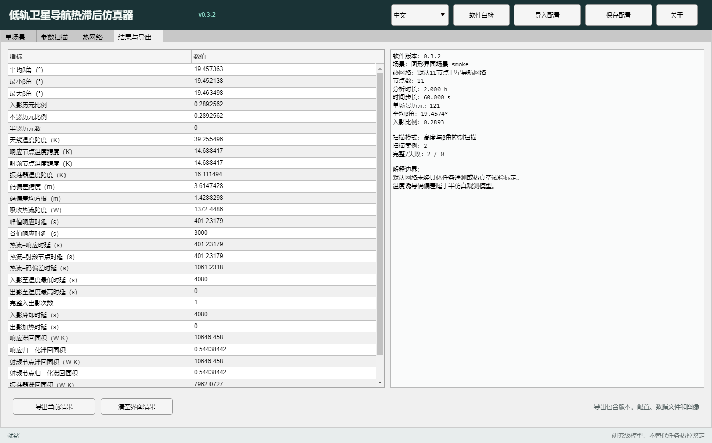

# LEO GNSS 热滞后仿真器图形界面使用说明

适用版本：0.12.0（历史参考手册）；当前 0.17.1 的首次运行请先阅读 [三步快速上手](快速上手_v0.17.1.md)。
适用环境：MATLAB R2021b及以上，需要启用 MATLAB 图形桌面和 Java 运行时

## 1. 启动

在MATLAB命令窗口执行：

```matlab
cd('H:/paper/leo-gnss-thermal-simulator')
launch_gui
```

默认使用中文。也可以在启动时直接指定语言：

```matlab
launch_gui('zh')  % 全中文
launch_gui('en')  % 全英文
```

启动后默认进入“快速开始”区域。第一次使用可选择“第一次仿真”，软件会载入
600 km 对地定向参考场景并运行 2 小时；“热滞后分析”使用 24 小时场景；“遥测验证”
只会进入遥测页面，不会在没有数据时生成验证结果。“高级仿真设置”进入完整配置工作区。

快速开始页还提供“打开示例项目”。示例项目是已经保存好的完整 MAT 工作区，适合直接观察
参数、结果和数据映射；它们是功能演示，不是具体卫星的标定结果。

也可以先执行 `startup`，再运行 `leotherm.launchApp('zh')`。界面顶部显示当前软件版本，
底部始终保留“研究级模型，不替代任务热控鉴定”的解释边界。

顶部语言选项可以随时切换中文和英文。切换会重建界面文字，但保留当前场景、热网络、
单场景结果和扫描结果；图题、坐标轴、表头、状态与图例会同步切换。语言选择也会写入
配置文件和结果清单。每个诊断子图都必须显示图例，即使该图只有一条曲线。

## 2. 单场景工作区

“单场景”页用于完成一次轨道—热流—温度—码偏差全链路仿真。

可直接设置：

- UTC分析日期、时长和时间步长；
- 轨道高度、倾角、RAAN和初始纬度幅角；
- J2长期漂移；
- 对地、对日或惯性姿态，以及滚转、俯仰和偏航角；
- 太阳直射、地球反照和地球红外开关；
- 自动周期热状态收敛或固定预热圈数。

运行后右侧同时显示太阳可见比例、三类外部热流、关键节点温度和半仿真温度诱导
码偏差。默认24 h场景比快速烟雾测试耗时更长，这是完整周期初始化和热积分的
正常结果。



## 3. 参数扫描工作区

支持两种互不混淆的实验设计：

1. 高度—β角控制扫描：根据目标有符号β角反求RAAN，不可达案例标记为
   `inaccessible`；
2. 日期—倾角—RAAN物理扫描：β角由真实太阳—轨道几何产生，是输出而不是输入。

数值列表支持逗号、空格和范围表达式，例如：

```text
400,600,800
0:10:80
60:-30:-60
```

日期使用 `yyyy-MM-dd` 并以逗号分隔。解析器不使用 `eval`，不能执行任意MATLAB
表达式。扫描沿用单场景页的时长、步长、姿态和环境设置；完整、失败和不可达状态
均保留，不插值。



## 4. 热网络工作区

内置三个预设：默认11节点GNSS网络、严格对称11节点网络和SATMO风格7节点网络。

左表可以修改：

- 热容、初始温度和内部功耗；
- 投影面积和辐射面积；
- 表面法向；
- 太阳吸收率和红外发射率；
- 各节点线性温度—码偏差灵敏度。

右表编辑节点间导热系数。修改一个方向时，界面自动同步其对称元素；对角线保持
为0。每次修改都会立即调用 `leotherm.validateNetwork`。不符合物理范围、法向非
单位向量或矩阵不对称时，界面显示错误并恢复修改前网络。

底部可以指定响应、天线、振荡器和二次偏差节点，并设置二次系数。



## 5. 遥测与验证

0.4.0增加“遥测与验证”页。先选择轨道遥测驱动、热功率遥测驱动或验证已有单场景，
再导出空模板或导入已有CSV，逐列确认时间、物理量、热节点和单位。
轨道模式要求同一地心惯性系的卫星与太阳位置；热功率模式要求所有节点的外部吸收
功率，不能直接输入电压。坏数据和过大间隔断段，不插值。

上方节点下拉框控制图中显示的节点，温度曲线和残差均有图例。下方表格记录误差和
逐行采用情况。切换语言保留映射与已有结果；修改遥测选项会清除旧结果，避免误读。
该页使用自己的“导出遥测结果”，保存完整输入、映射、模型、质量记录和解释报告。



详细字段和独立性要求见[遥测导入与验证](遥测导入与验证.md)。真实公开数据的
导入案例见[GRACE-FO遥测检查](../studies/telemetry/README_CN.md)。

## 6. 结果与导出

“结果与导出”页将关键指标显示为当前语言的名称和数值，并记录软件版本、
场景、热网络、历元数和扫描完成状态。

“导出当前结果”会创建带时间戳的独立目录，其中包括：

```text
configuration.mat
manifest.txt
scenario/scenario_result.mat
scenario/timeseries.csv
scenario/metrics.csv
scenario/network_nodes.csv
sweep.mat
sweep.csv
scenario_panel_*.png
sweep_panel_*.png
```

只有实际存在的单场景或扫描结果才会写出。清空界面结果不会清空当前场景和热网络。



## 7. 配置和软件自检

顶部“保存配置”保存 `scenario`、`network`、显示语言和软件版本。“导入配置”只接受同时
包含 `scenario` 和 `network` 的MAT文件，导入前执行完整校验。

“软件自检”运行与命令行 `leotherm.selfTest` 相同的自动测试。正式批量实验前，
建议先确认全部测试通过。

## 8. 已知限制

- 当前求解仍在MATLAB主进程中同步执行；单个正在积分的案例不能从界面中途取消。
- 大型扫描会显示忙碌状态，但公共扫描尚未提供GUI级逐案例暂停和检查点管理。
- 界面不能仅从数值自动识别轨道是惯性系还是地固系；遥测工作区要求用户明确
  坐标系与单位，不能勾选一个确认框就把地固坐标转换成惯性坐标。
- 软件诊断图用于检查结果，不替代论文投稿图。投稿图应继续使用独立的规范绘图流程。
- 默认热网络未经特定卫星遥测或热真空数据标定。
